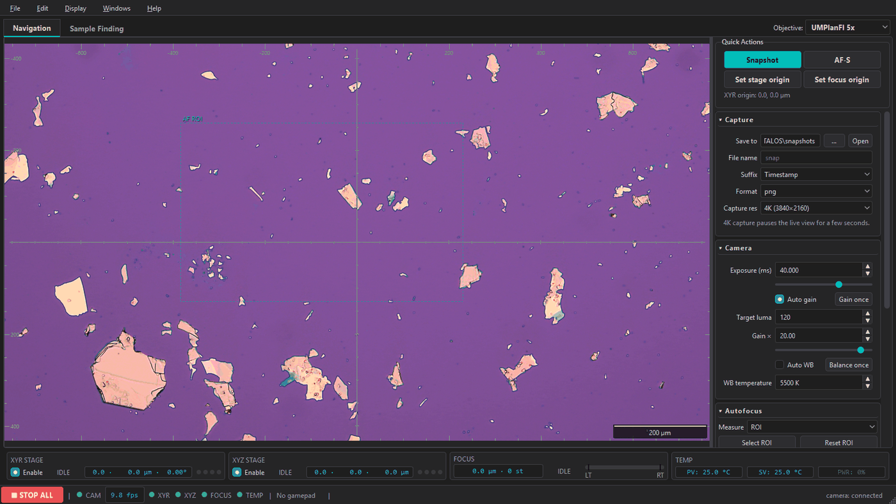
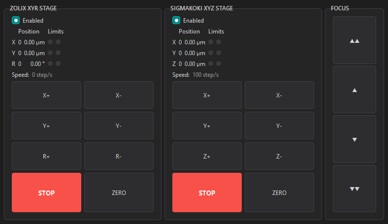
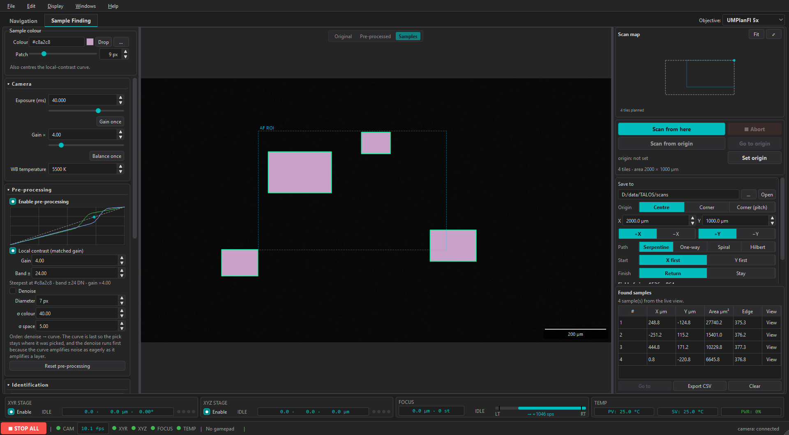
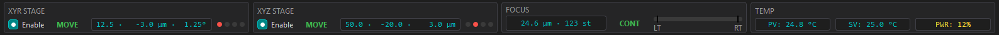

# TALOS — Transfer and Alignment Laboratory Operating System



*The Navigation workspace: live view with a calibrated tick ruler, inverse-video crosshair, AF
measurement region and scale bar, the Capture/Camera/Autofocus panels, and the instrument strip.
Captured on the simulated bench (`--sim`); the live view shows a frame recorded on the real bench.*

TALOS is a microscope control and computer-vision application for 2D-material transfer and stacking.
It drives the sample stage, the transfer stage, the focus axis, the hot stage and the camera from a
single window, and provides the measurement and automation built on top of them: autofocus,
calibrated overlays, flake detection, grid scanning. It was written for one laboratory bench — an
Olympus BXFM frame with a Zeiss camera, a hybrid setup whose moving parts are largely DIY — and is
structured so that the next bench does not have to be the same one.

TALOS is research software under active development. Manual control and autofocus are bench-proven;
the sample-finding and grid-scan modules are incomplete and still being worked on, and are described
as such in the limitations below.

## Overview

**One application for the whole bench.** The camera, both stages, the focus axis and the hot stage
are driven from a single process: one live view, one status strip, one log, one settings file, and
one stop-all that reaches every axis. Each instrument is opened once and owned by one worker thread,
so two parts of the application cannot contend for a port or a controller.

**Gamepad-first manual control.** The routine workflow — jogging both stages, selecting which stage
the D-pad drives, gating a stage's enable, running autofocus, stopping everything — is mapped onto a
game controller, which is the recommended way to drive the bench. Keyboard and mouse remain
available and functional, but a transfer session does not need them.

**Stop-all and motion interlocks.** `Esc`, or both bumpers on the pad, stops the focus, transfer and
XYR axes, verified within a 1.5 s budget. The stop is latched: motion stays suppressed until every
input source is at rest, so a stick left off-centre cannot resume a jog on release. Manual motion is
refused while a scan owns the axes, and any input during autofocus aborts the run and takes over.

**Autofocus designed around the measured axis.** The focus axis is open-loop — 0.2 µm per step, no
encoder — so the autofocus measures the focus curve rather than assuming its width. On this bench the
curve's width is the depth of focus itself, 2.3× the conventional σ ≈ DOF/3 estimate, and a search
sized by that rule is too narrow to find the peak. The implemented strategy probes the curve,
classifies its shape and lands by returning from the direction it measured; repeatability is 8 steps
(1.6 µm), a near-focus approach takes about 6 s, and an abort stops a moving axis in 0.20 s. Exposure
and gain are never modified by any autofocus path.

**Automation.** Bounded autofocus (window clamped inside the soft limits, readback verification after
every move) and backlash auto-calibration (≤ 0.4 µm repeatability) are the established parts. The
grid scan and the sample-identification chain exist and run — capture, tile manifest, mosaic and
candidate list — but have not yet been through a bench campaign, so they are still under
development; see *Known limitations*.

**Hardware abstraction.** Every instrument sits behind an abstract interface with a factory registry
and a worker thread of its own, and each has a simulated counterpart, so `python -m talos --sim` runs
the entire application without hardware. The job model, abort paths and interlocks are independent of
the instruments: a new device is a driver class plus a registry entry.

## Safety first

This software commands physical motion. Read this before running it against hardware.

- **`Esc` is STOP ALL.** It stops every motion axis, verified within a 1.5 s budget, from the main
  window and from the Stage Control and AF windows. It *latches*: motion stays suppressed until every
  input source — keys, on-screen holds, gamepad — is at rest. On a gamepad, holding both bumpers does
  the same; its Start button is **not** a stop (it toggles the selected stage's enable gate, which
  halts that stage and drops its commands).
- **The focus axis may have no limit sensor.** On the reference bench it has none, and the
  firmware's soft limits ship disabled; the application reports that condition at autofocus start and
  clamps the search window itself. The residual risk is lost steps, not a crash.
- **Autofocus is bounded**: the window is clamped inside the soft limits, every move is verified by
  readback, and the abort is polled *while the axis is travelling*, so a jog or a STOP ALL stops it
  immediately. What autofocus will and will not do to the axis, the camera and the stored calibration
  is listed in [docs/AUTOFOCUS.md](docs/AUTOFOCUS.md).
- **Manual motion is gated by mode**: jog inputs are refused during a grid scan, and any input during
  autofocus aborts the run and takes over.
- **Controllers can forget their position on power-cycle** — treat stored coordinates as
  session-relative and re-establish references after a reset.
- **A camera may need exclusive access** to its USB interface: close the vendor application while
  TALOS runs, and vice versa.

Before automating a new bench, run `tools/smoke_test.py` — an ordered, read-only-first device
checklist — and keep a physical stop within reach for the first motions. `python -m talos --sim`
exercises the same code paths with no hardware.

## Install and run

Windows only, by construction: the camera binds libusb0, the gamepad is read
through XInput, and the build script is PowerShell.

```powershell
conda env create -f environment.yml
conda activate talos

python -m talos          # real hardware
python -m talos --sim    # simulated devices (safe, no hardware)
```

The first real launch applies the saved defaults to the camera and connects
every enabled device; each device that fails to open is reported in the log and
the rest keep working.

## Controls

`Esc` = **STOP ALL** (the only global stop). Gamepad:

| Control | Action |
|---|---|
| left stick | X/Y jog on the transfer (SigmaKoki) stage, analog |
| right stick | X/Y jog on the XYR (Zolix) stage, 8-direction — R is on the X/Y face buttons |
| D-pad | X/Y of the *selected* stage — short press = one step, hold = continuous |
| **Back** | cycles which stage the D-pad drives (transfer ⟷ XYR); the status bar shows the current choice |
| **Start** | toggles the enable gate of the D-pad-selected stage. Disabling stops that stage immediately and drops its commands; the strip's Enable checkbox follows |
| triggers (L/R) | focus, analog speed |
| **LT + RT** (both) | **autofocus once** |
| **LB + RB** (both) | **STOP ALL** — same as Esc, including the latch |
| X / Y | Zolix R (rotation), − / + — short press = one step, hold = continuous (RB = fast) |
| A / B | SigmaKoki Z (transfer height), + / − — short press = one step, hold = continuous (LB = fast) |

The two gestures are edge-triggered after a **0.2 s hold**, so a bump past a
bumper cannot stop a running job by accident. While a gesture is held it owns
its inputs: LT+RT stops any focus jog and emits none (otherwise the gesture's
own trigger imbalance would abort the autofocus it just started), and LB+RB
stops a stick-driven jog. A single bumper keeps its normal meaning (fast
modifier), as does a single trigger (focus jog).

Keyboard: `W/A/S/D` = Zolix X/Y, `Q/E` = Zolix R, arrows = transfer X/Y, `R/F` =
transfer Z, `+`/`-` = focus, `Shift` = fast. Tap gives one step and hold gives
continuous motion everywhere except focus, which jogs immediately. The on-screen
hold buttons behave identically and release on pointer-leave, window hide or Esc.

Manual jogging can be driven three ways, in descending order of ergonomics:

- **Gamepad — the recommended route.** Both sticks, the D-pad, the triggers and the face buttons
  cover the whole manual workflow; the mapping is the table above.
- **Keyboard — adequate.** Convenient for occasional moves, with the same tap-versus-hold semantics.
- **Mouse, through the Stage Control window** (**Windows → Stage Control**) — **the fallback.** It is
  there for when the keyboard and the pad are out of reach or out of favour (inside a glovebox, for
  instance): one panel per stage, large hold-to-jog buttons, live position and limit indications,
  and per-panel STOP and ZERO. On a touchscreen it doubles as a touch panel, but it remains the
  slowest of the three ways to move an axis.



*The Stage Control window: one panel per stage, with per-axis jog buttons, live position and limit
indications, and per-panel STOP and ZERO.*

Any axis can be inverted for *manual* motion, and either stage's axes swapped
(X↔Y), in **Preferences → Hardware → the device → Axis direction**. These affect
manual motion only: position readback, autofocus, the flake "go to" move and the
grid scan are computed motions and are never inverted, because that would
silently corrupt stored coordinates. The camera flip is separate again — it
rotates the image and never touches an axis.

## Workspaces

- **Navigation** — live view, quick actions (snapshot, AF-S, origins), and
  foldable right-panel groups for Capture / Camera / Autofocus / Temperature.
  Manual jogging is on the gamepad (the recommended route), the keyboard, or in
  the Stage Control window.
- **Sample Finding** — three columns: the camera and the computer vision on the
  left, the live view in the middle, and the scan on the right.

  **Left.** The sample colour is pinned at the top — the one control touched
  constantly, because it is both the mask's target and the centre of the
  local-contrast curve. Below it, foldable groups for the camera's manual
  profile (identification needs a stable image, not an auto-adjusted one), the
  **pre-processing** chain and the **identification** chain.

  **Centre.** The live view, with a floating **Original / Pre-processed /
  Samples** switch. *Pre-processed* is what the filters make of the frame — and
  it is the layer the dropper samples. *Samples* shows the identification
  result: everything the chain did not match darkened, every match outlined —
  brightly for what survived the chain, dimly for what a gate threw away. Both
  are display choices only: the stream, the autofocus and a running scan never
  wait on them.

  **Right.** The scan map, the run card, the settings worth changing at the
  microscope (the only part that scrolls), and — pinned below them, always
  visible — the table of samples that were found, with *go to* to bring one
  under the crosshair.

  The **run card** is where a run starts, and it starts one of two ways: from
  where the stage is standing, or from the **origin**. The origin is the same
  one the Navigation tab marks — one value, two tabs — and the card carries
  the three controls for it: *Set origin* (mark where the stage is now), *Go
  to origin*, and *Scan from origin*. That last one anchors the AREA at the
  origin and moves straight to the first tile's centre: in the corner origin
  modes that centre is inset half a field of view, so the marked corner lands
  where you meant it to, on the corner of the first FRAME.

**Pre-processing** is what makes a thin sample visible: an edge-preserving
denoise for the noise a gain would amplify, and a **local-contrast curve** that
steepens the tone curve at the colour you picked and flattens it everywhere
else. A monolayer and a bilayer a few levels apart become a difference you can
see, while the picked colour itself does not move — it is the same hex the
colour mask searches for, so the sample cannot disappear the moment you switch
the filter on. The camera's own exposure, gain and white balance are the only
tone controls, deliberately: one set of them, not two.



*The Sample Finding tab in **Samples** mode, with pre-processing on and a
local-contrast curve at ×4: the pinned colour picker (the colour, the dropper
and the patch size) and the camera/CV groups on the left — the filter's three
channel curves plotted against the identity, and the identification chain in
pipeline order, colour match first — the live view in the middle, and on the
right the scan map, the run card, the scan settings and the list of what the
chain found, each row with a *View* that opens the frame it was found in,
ringed. Everything the chain did not match is darkened; each match keeps its
own pixels and takes a bright outline. (The live list and the stage counts come
from the chain, so they fill in *Samples* mode — the other two views do not
run it.)*

**The scan** covers a rectangle of the sample and records where every frame was
taken. You choose what the start position *means* — the centre of the first
tile, or a **corner** of the area (which covers the region with the fewest
frames and lands on the far edge to the micron) — plus the area, the
directions, the path order and the start axis. The field of view is **read from
the objective's calibration**, with no manual override: the tile count follows
the objective, and there is one number for the panel to state — `measured in
TALOS` or `imported from Labscope`, or a plain warning when it can only
estimate. *Scan from here* starts at the current position and returns there
when it finishes. Overlap, settle, scan speed, backlash and which extra files a
run writes live in **Preferences → Scan**.

Identification runs on each captured frame on its own, at full resolution; the
mosaic is an overview for the eye, and nothing measures from it. Every scan
writes `manifest.csv` and the raw frames, and optionally a mosaic, that same
mosaic with the found samples ringed and numbered, and the candidate list.

A scan owns the axes while it runs: manual jogging is refused (the mode badge in
the status bar says so), and **STOP ALL** — Esc or LB+RB — stops the stage and
aborts the run.

Menus: **File**, **Edit → Preferences** (`Ctrl+,`), **Display** (overlays, scale
bar), **Windows** (AF Detail, Stage Control, Log), **Help**. Display
toggles the live-view overlays: scale bar (with optional burn-in for snapshots),
the AF status pill, crosshairs (inverse-video, so they stay visible on any
image) with an optional calibrated tick reticle, and a µm tick ruler on all four
frame edges.

Two Preferences points worth knowing:

- **Camera flip** (Hardware → Camera → Image orientation, default ON) rotates
  every frame 180° so the optically inverted image reads in real-world
  orientation. It applies to the live view, autofocus, flake detection *and*
  saved snapshots, and is deliberately independent of the stage axis inversion.
  Changing it mid-session mirrors the AF region and clears the detected-flake
  table, both of which are tied to the old orientation.
- **Connection settings reconnect on Apply**: changing a port, slave address or
  timeout rebuilds that device's driver immediately (the LED shows CONNECTING
  while it swaps). It is refused — with a log line — while a scan or an
  autofocus run owns the axes; re-apply after the job.

## Hardware

This is the bench the project is **currently developed against** — the instruments the author works
with and has implemented drivers for. It is not a required configuration: the HAL exists so that
other hardware can be substituted (see *Adapting TALOS to your hardware* below), and two of the five
instruments are DIY builds rather than commercial products.

| Instrument | Interface | Driver module |
|---|---|---|
| Zeiss Axiocam 208 color camera | SmartCamApi over libusb0 (ZEN/Labscope driver) | `talos/hal/devices/camera/smartcam_backend.py` |
| Zolix ZC300 XYR sample stage | Modbus RTU, 115200 8N1 | `talos/hal/devices/zolix.py` |
| DIY SigmaKoki XYZ transfer stage | ASCII line protocol over Arduino | `talos/hal/devices/sigmakoki.py` |
| DIY focus stage (Arduino + CRD5103PB) | ASCII line protocol, **no limit sensor** | `talos/hal/devices/focus.py` |
| Yudian AI-828 temperature controller | Modbus RTU | `talos/hal/devices/yudian.py` |

Ports, speeds and limits live in `resources/defaults/default_settings.json` and
are editable in Preferences (the user's copy is `%APPDATA%\TALOS\settings.json`).



*One strip carries every instrument's live state — stage positions and limit
switches, focus position and mode, heater PV/SV/output — with the enable gates
beside them.*

The camera works over SmartCamApi at ~15–19 fps in 1080p with exposure/gain/white-balance control
plus 4K live and 4K snapshots; this model has no hardware fixed-white-balance gain pair (that
parameter is read-only), so "fixed WB" here means AWB off plus a colour temperature — see
[docs/CAMERA_208.md](docs/CAMERA_208.md).

## Calibration

The canonical calibration is **µm per 4K-sensor pixel**. The live 1080p stream
covers 2× that per pixel, and the 4K snapshot path uses it directly; both the
scale bar and the burned-in snapshot bar are derived from one shared layout
module. Objective µm/px values are editable per objective in
**Preferences → Objectives & Calibration** and are stored in
`%APPDATA%\TALOS\calibration.db`, where values measured in TALOS take precedence
over values imported from Labscope.

## Adapting TALOS to your hardware

The tables and firmware above are one bench. The reason they are brief is that
they are meant to be replaced. Adding an instrument:

1. **Subclass the interface** it fits — `Camera`, `FocusStage`, `XYRStage`,
   `XYZStage`, `TemperatureController`, `AbstractDevice` — from
   [talos/hal/base.py](talos/hal/base.py), in `talos/hal/devices/<name>.py`.
   Drivers are blocking, Qt-free and timeout-guarded; `stop()` must never raise.
2. **Add a simulated twin** in [talos/hal/sim/](talos/hal/sim/) so the whole app
   still runs with `--sim` (and so your tests need no hardware).
3. **Register both** in [talos/hal/registry.py](talos/hal/registry.py) —
   `_REAL`, `_SIM` — and add the key to `DEVICE_KEYS` (and to `MOTION_KEYS` if it
   moves, so STOP ALL covers it).
4. **Add its defaults** under `devices.<key>` in
   `resources/defaults/default_settings.json`; that file *is* the settings schema.
5. **Optional:** list its connection keys in `_CONNECTION_KEYS`
   ([talos/instruments.py](talos/instruments.py)) so that changing a port or
   address in Preferences rebuilds the driver in place, and add a Preferences
   page (one `pages.append(...)` line).
6. **Test it** against `tests/testing/fake_serial.py` (drivers) or a fake camera,
   and add a closed-loop sim test if it moves.

If your instrument speaks Modbus RTU or ASCII lines, the two shared wire
protocols in [talos/protocols/](talos/protocols/) already cover the transport.
The job model, the abort paths, the safety latches and the entire UI are
hardware-independent and do not change. The long form of this checklist, plus
the bench tools for validating a new driver against real hardware, is
[docs/DEVELOPMENT.md](docs/DEVELOPMENT.md).

## Project layout

```
talos/
  app.py, bootstrap.py        application shell, startup wiring
  config.py, paths.py         settings (JSON, layered over defaults), locations
  instruments.py              InstrumentManager: single writer for every device
  models.py                   shared dataclasses (positions, statuses, jobs)
  calibration_store.py        SQLite objective/calibration table
  hal/                        drivers, proxies (one worker thread per device), sim devices
  cv/                         autofocus strategies, grid scan, identification chain, metrics
  input/                      gamepad + keyboard/UI resolver (all motion gating)
  ui/                         windows, dialogs, widgets, workspaces, theme
tests/                        unit / sim / integration suites
tools/                        hardware benches and probes (not part of the app)
arduino_firmware/             focus-controller firmware sources
docs/                         design, architecture, hardware notes, camera interop
```

## Documentation

| Document | What is in it |
|---|---|
| [docs/DESIGN.md](docs/DESIGN.md) | How TALOS is put together and why: the bench, the decisions, the hardware register maps, and where the build diverged from the plan |
| [docs/ARCHITECTURE.md](docs/ARCHITECTURE.md) | Layers, threading and proxy life-cycle, the job model, safety interlocks, known weaknesses |
| [docs/AUTOFOCUS.md](docs/AUTOFOCUS.md) | The axis physics, the algorithm and its safety invariants, the measured numbers, the tuning ladder |
| [docs/SCAN.md](docs/SCAN.md) | The grid scan: the geometry and its coverage proof, the path orders, settling and backlash, capture through the frame slot, what a scan writes, which way is up |
| [docs/IDENTIFICATION.md](docs/IDENTIFICATION.md) | The identification chain: the eight stages, the three matching methods, the rules it must keep, the processed view, tuning it on a real wafer |
| [docs/CAMERA_208.md](docs/CAMERA_208.md) | What the Axiocam 208 can and cannot do, and how to coexist with ZEN |
| [docs/SMARTCAM_API.md](docs/SMARTCAM_API.md) | Interoperability notes for the SmartCamApi DLL |
| [docs/hardware/focus/protocol.md](docs/hardware/focus/protocol.md) | The focus controller's complete serial protocol |
| [docs/DEVELOPMENT.md](docs/DEVELOPMENT.md) | Tests, bench tools, packaging, and adding an instrument |

## Related projects and acknowledgements

- **[transfer-stage-control](https://github.com/Lewbert/transfer-stage-control)** — the precursor
  project, from which TALOS's input system (keyboard, gamepad, motion gating) is a faithful port,
  and where several of the instrument patterns were first worked out. MIT.
- **[2D-SS-Exfoliated-Flake-Recognition-System](https://github.com/thepete6186/2D-SS-Exfoliated-Flake-Recognition-System)**
  — flake-recognition work on exfoliated 2D samples. **Thanks to Peter Cheng (thepete6186) for
  testing the scan and sample-finding ideas on the setup in our lab**, which is what told us which
  parts of a scan workspace an experimentalist actually reaches for.

## Tests, tools and packaging

```powershell
python -m pytest                  # everything — the real-time simulations dominate
python -m pytest -m "not slow"    # the fast subset (order of a minute)
```

About 890 tests (800 fast + 89 `slow`): unit tests for the drivers/CV/settings/UI
wiring, integration tests for the job/stop/reconnect machinery, and closed-loop
**simulations** that run the autofocus strategies and the grid scan against
simulated hardware — the scan suite captures frames through the same frame slot
the application uses, and checks that a stalled camera leaves waypoints missing
rather than misfiled. Hardware-in-the-loop checks live in `tools/` rather than in
the suite, so the suite needs no instruments.

The bench tools that matter most day to day:

- `tools/smoke_test.py [--motion]` — an ordered, cautious device checklist for a
  new or reconfigured bench. Read-only unless you pass `--motion`.
- `tools/dev_console.py` — a read-only device console (no motion), for looking at
  what an instrument actually reports.
- `tools/ui_shot.py`, `tools/ui_scale_check.py` — the UI screenshot rig and the
  scale-bar pixel check.
- The rest — autofocus benches, camera and serial forensics, the hardware scan
  bench — are listed in [docs/DEVELOPMENT.md](docs/DEVELOPMENT.md).

Packaging:

```powershell
pwsh -File packaging/build.ps1     # -> dist/TALOS/talos.exe (one-dir, portable)
```

The frozen build excludes the unwired camera backends. Drop an icon at
`resources/icons/talos.ico` and it is embedded automatically (see
`resources/icons/README.md`).

## Known limitations / deferred

- The scan and the identification chain have not been run on hardware yet. They
  are exercised end to end in simulation (the scan captures frames through the
  application's own frame slot), but a bench campaign is still owed — the
  capture path, the tile geometry and the colour thresholds all need it.
- Sample identification is deliberately simple: what the operator points at,
  matched by colour and filtered by size, sharpness and shape. It does not judge
  thickness, and on a wafer whose flakes share a hue with the substrate it will
  find substrate.
- GenTL / Micro-Manager / MCam / DirectShow camera backends stay in the tree as
  stored knowledge but are unwired: they need a USB3-Vision driver this bench
  does not have, or are far too slow (see
  `talos/hal/devices/camera/__init__.py`).
- The temperature controller is monitor-only when its serial link is flaky;
  setpoint writes are gated by the configured safety range.
- The live view receives frames as queued signal payloads rather than pulling
  from the shared frame slot; the shared slot is already used by autofocus.
- The bundled defaults still open a debug console and enable verbose logging
  (both are Preferences toggles), and the application icon is a placeholder.
- The autofocus derivative branch is inactive on the multi-peak field this bench
  currently works on; the algorithm falls back to its probe-driven path, which is
  what the measurements above describe.

## License and citation

TALOS is free software under the GNU General Public License, version 3 (only) — see [LICENSE](LICENSE); for commercial licensing, contact the author. If you use TALOS in academic work, cite the
repository; [CITATION.cff](CITATION.cff) has the metadata to do so.
